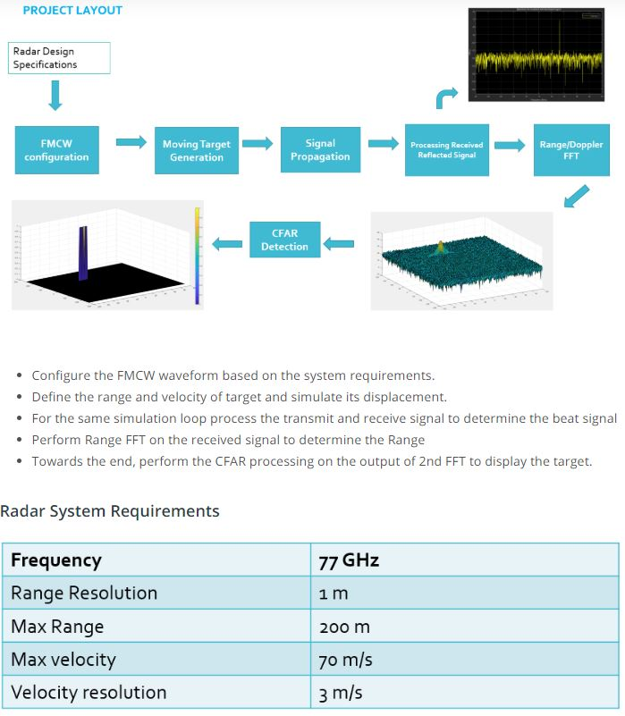
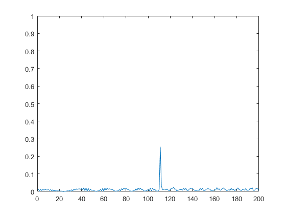
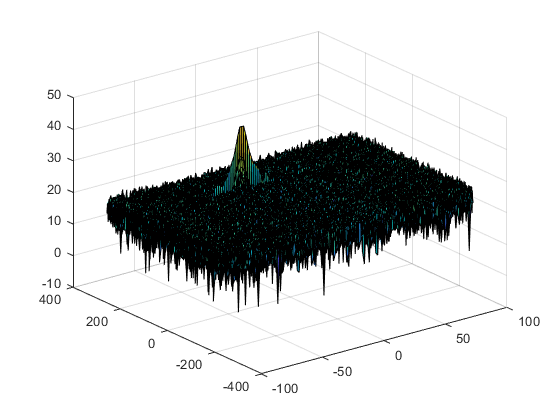
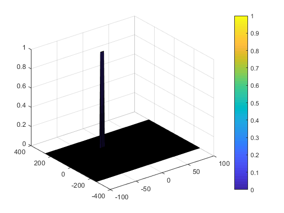

# SFND_P2_Radar_Target_Generation_and_Detection
Udacity, Sensor Fusion, Project of Radar Target Generation and Detection

## Project Layout:


* Refer to `radar_target_generation_and_detection.m`

---
#### 1. Radar Specifications 
* Frequency of operation = 77GHz
* Max Range = 200m
* Range Resolution = 1 m
* Max Velocity = 100 m/s
```
Max_Range_of_Radar = 200; 
Max_Velocity_of_Radar = 100;
Range_Resolution_of_Radar = 1;
speed_of_light = 3e8;
```

#### 2. User Defined Range and Velocity of target

* define the target's initial position and velocity. 
* Note : Velocity remains contant
```
Range_of_target = 110; % Target Initial Range
Velocity_of_target  = -20; % Target Velocity
```

#### 3. FMCW Waveform Generation
* Design the FMCW waveform by giving the specs of each of its parameters.
* Calculate the Bandwidth (B), Chirp Time (Tchirp) and Slope (slope) of the FMCW chirp using the requirements above.

* Operating carrier frequency of Radar 
```
fc= 77e9;             %carrier freq
sweep_time_factor = 5.5;

B      = speed_of_light / (2 * Range_Resolution_of_Radar); % Bandwidth of the FMCW, Bsweep 
Tchirp = (sweep_time_factor*2*Max_Range_of_Radar)/speed_of_light; % Chirp Time of the FMCW
slope  = B/Tchirp; % Slope of the FMCW
```                                                          
* The number of chirps in one sequence. 
* Its ideal to have `2^value` for the ease of running the FFT for Doppler Estimation. 
```
Nd=128;                   % # of doppler cells OR # of sent periods % number of chirps
```
* The number of samples on each chirp. 
```
Nr=1024;                  % for length of time OR # of range cells
```
* Timestamp for running the displacement scenario for every sample on each chirp
```
t=linspace(0,Nd*Tchirp,Nr*Nd); %total time for samples
```
* Creating the vectors for Tx, Rx and Mix based on the total samples input.
```
Tx=zeros(1,length(t)); %transmitted signal
Rx=zeros(1,length(t)); %received signal
Mix = zeros(1,length(t)); %beat signal
```
* Similar vectors for range_covered and time delay.
```
r_t=zeros(1,length(t)); % range_covered
td=zeros(1,length(t)); % time delay
```

#### 4. Signal generation and Moving Target simulation
```
for i=1:length(t)         
       
    % For each time stamp update the Range of the Target for constant velocity.     
    r_t(i) = Range_of_target + (Velocity_of_target*t(i)); % range_covered
    td(i) = (2*r_t(i)) / speed_of_light; % time delay
    
    % For each time sample we need update the transmitted and received signal.
    Tx(i) = cos( 2*pi*( fc*(t(i)        ) + ( 0.5 * slope * t(i)^2)         ) );
    Rx(i) = cos( 2*pi*( fc*(t(i)-td(i)  ) + ( 0.5 * slope * (t(i)-td(i))^2) ) );
    
    % Now by mixing the Transmit and Receive generate the beat signal
    % This is done by element wise matrix multiplication of Transmit and Receiver Signal
    Mix(i) = Tx(i).*Rx(i); 
end
```

#### 5. Range Measurement

* Reshape the vector into Nr*Nd array. 
* Nr and Nd here would also define the size of Range and Doppler FFT respectively.
```
Mix = reshape(Mix,[Nr,Nd]);
```
* run the FFT on the beat signal along the range bins dimension (Nr) and
```
sig_fft1 = fft(Mix,Nr);  
```
* normalize.
```
sig_fft1 = sig_fft1./Nr;
```
* Take the absolute value of FFT output
```
sig_fft1 = abs(sig_fft1);  
```
* Output of FFT is double sided signal, but we are interested in only one side of the spectrum.
* Hence we throw out half of the samples.
```
single_side_sig_fft1 = sig_fft1(1:Nr/2);
```
* Plotting the range, plot FFT output 
```
figure ('Name','Range from First FFT')
plot(single_side_sig_fft1); 
axis ([0 200 0 1]);
```
* Simulation Result


#### 6. Range Doppler Response
* The 2D FFT implementation is already provided here. 
* This will run a 2DFFT on the mixed signal (beat signal) output and generate a range doppler map.
* You will implement CFAR on the generated RDM Range Doppler Map Generation.
* The output of the 2D FFT is an image that has reponse in the range and doppler FFT bins. 
* So, it is important to convert the axis from bin sizes to range and doppler based on their Max values.
```
Mix = reshape(Mix,[Nr,Nd]);
```
* 2D FFT using the FFT size for both dimensions.
```
sig_fft2 = fft2(Mix,Nr,Nd);
```
* Taking just one side of signal from Range dimension.
```
sig_fft2 = sig_fft2(1:Nr/2,1:Nd);
sig_fft2 = fftshift (sig_fft2);
RDM = abs(sig_fft2);
RDM = 10*log10(RDM) ;
```
* Use the surf function to plot the output of 2DFFT and to show axis in both dimensions
```
doppler_axis = linspace(-100,100,Nd);
range_axis = linspace(-200,200,Nr/2)*((Nr/2)/400);
figure ('Name','Range and Speed From FFT2')
surf(doppler_axis,range_axis,RDM);
```
* Simulation Result


#### 7. CFAR implementation
* Slide Window through the complete Range Doppler Map
* Select the number of Training Cells in both the dimensions.
```
Tr = 10;
Td = 8;
```
* Select the number of Guard Cells in both dimensions around the Cell under test (CUT) for accurate estimation
```
Gr = 4;
Gd = 4;
```
* Offset the threshold by SNR value in dB
```
offset = 1.4;
```
* Create a vector to store noise_level for each iteration on training cells design a loop such that it slides the CUT across range doppler map by giving margins at the edges for Training and Guard Cells.
* For every iteration sum the signal level within all the training cells. 
* To sum convert the value from logarithmic to linear using db2pow function. 
* Average the summed values for all of the training cells used.
* After averaging convert it back to logarithimic using pow2db.
* Further add the offset to it to determine the threshold. 
* Next, compare the signal under CUT with this threshold. 
* If the CUT level > threshold assign % it a value of `1`, else equate it to `0`.
* Use `RDM[x,y]` as the matrix from the output of 2D FFT for implementing CFAR
```   
RDM = RDM/max(max(RDM));

for i = Tr+Gr+1:(Nr/2)-(Gr+Tr)
    for j = Td+Gd+1:Nd-(Gd+Td)
        
       % Create a vector to store noise_level for each iteration on training cells
        noise_level = zeros(1,1);
        
        % Calculate noise SUM in the area around CUT
        for p = i-(Tr+Gr) : i+(Tr+Gr)
            for q = j-(Td+Gd) : j+(Td+Gd)
                if (abs(i-p) > Gr || abs(j-q) > Gd)
                    noise_level = noise_level + db2pow(RDM(p,q));
                end
            end
        end
        
        % Calculate threshould from noise average then add the offset
        threshold = pow2db(noise_level/(2*(Td+Gd+1)*2*(Tr+Gr+1)-(Gr*Gd)-1));
        threshold = threshold + offset;
        CUT = RDM(i,j);
        
        if (CUT < threshold)
            RDM(i,j) = 0;
        else
            RDM(i,j) = 1;
        end
    end
end
```
* The process above will generate a thresholded block, which is smaller than the Range Doppler Map as the CUT cannot be located at the edges of matrix. 
* Hence,few cells will not be thresholded. 
* To keep the map size same set those values to 0. 
```
RDM(union(1:(Tr+Gr),end-(Tr+Gr-1):end),:) = 0;  % Rows
RDM(:,union(1:(Td+Gd),end-(Td+Gd-1):end)) = 0;  % Columns 
```
* Display the CFAR output using the Surf function like we did for Range
* Doppler Response output.
```
figure('Name','CA-CFAR Filtered RDM')
surf(doppler_axis,range_axis,RDM);
colorbar;
```
* Simulation Result

